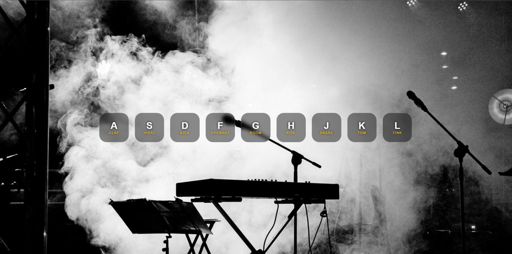

# 🥁 Drum Kit

An interactive browser-based drum kit that lets you play drum sounds using your **keyboard** or **mouse clicks**.



## 🎮 Demo

> Play it live: [Live link](https://ashutosht0210.github.io/Drum-Kit/)

---

## 🎵 Keys & Sounds

| Key | Sound |
|-----|-------|
| A | Clap |
| S | Hi-Hat |
| D | Kick |
| F | Open Hat |
| G | Boom |
| H | Ride |
| J | Snare |
| K | Tom |
| L | Tink |

---

## ✨ Features

- 🎹 Play sounds via **keyboard keys** (A S D F G H J K L)
- 🖱️ Play sounds via **mouse click** on each button
- 💥 Satisfying **pop/press animation** on every hit
- 🎨 **Frosted glass** buttons over a concert stage background
- ⚡ Rapid hitting supported — sounds restart instantly on repeated keypress

---

## 🚀 Getting Started

1. Clone the repo:
   ```bash
   git clone https://github.com/ashutosht0210/Drum-Kit.git
   ```

2. Open `index.html` in your browser — no install needed!

> ⚠️ If sounds don't play, make sure the `sounds/` folder is present with all `.wav` files.

---

## 📁 Project Structure

```
Drum-Kit/
├── README.md
├── index.html
├── style.css
├── app.js
├── background.jpg
├── screenshot.png
├── LICENSE
└── sounds/
    ├── clap.wav
    ├── hihat.wav
    ├── kick.wav
    ├── openhat.wav
    ├── boom.wav
    ├── ride.wav
    ├── snare.wav
    ├── tom.wav
    └── tink.wav
```

---

## 🛠️ Built With

- HTML5
- CSS3 (Flexbox, backdrop-filter, keyframe animations)
- Vanilla JavaScript (Audio API, KeyboardEvent)

---

## 📄 License

This project is open source and available under the [MIT License](LICENSE).
